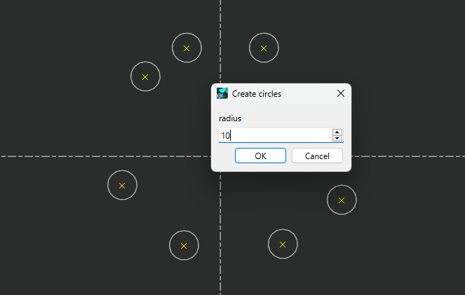

# Script Usage and Process

## Introduction
This script is provided by GO2cam International

## Prerequisites
This script works starting with V6.11.204 of GO2cam Production software

## Script Use
When you launch the script, you will select points.
You will define a radius.
After validation circles will be created on points.

#Video
![alt text] (https://support.go2cam.net/go2portal/DlMacros/CircleOnPoints.mp4 "CircleOnPoints.mp4")
