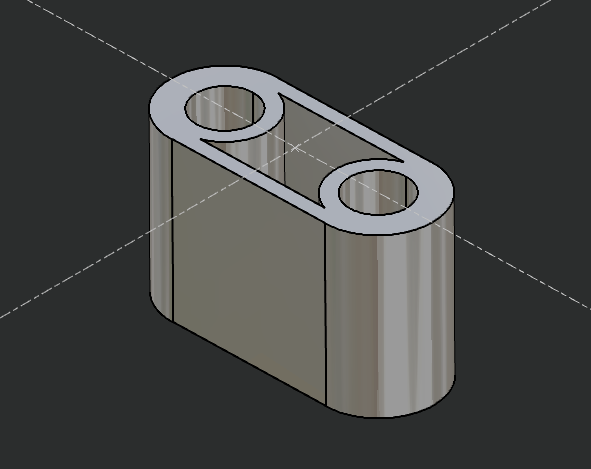

# Script Usage and Process

## Introduction
This script is provided by GO2cam International

## Prerequisites
This script works starting with V6.11.204 of GO2cam Production software

## Script Use
When you launch the script, you will select two arcs or circles geometry.
All the geometry will move in XY to set the center of two centers at the coordinates 0,0

You can select wireframe geometry or edges on solid.

#Video
![alt text] (https://support.go2cam.net/go2portal/DlMacros/OriginBetweenTwoArcs.mp4 "OriginBetweenTwoArcs.mp4")