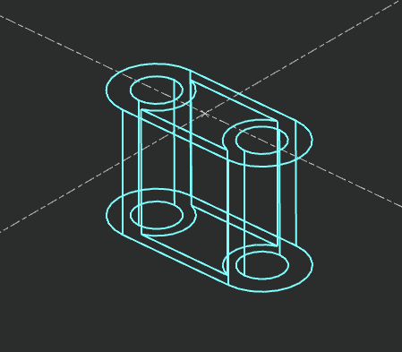

# Script Usage and Process

## Introduction
This script is provided by GO2cam International

## Prerequisites
This script works starting with V6.11.204 of GO2cam Production software

## Script Use
When you launch the script, you will select a standalone surface.
All the surfaces with same superficy will be converted as wireframe.

#Video
![alt text] (https://support.go2cam.net/go2portal/DlMacros/SurfaceToWireframe.mp4 "SurfaceToWireframe.mp4")
